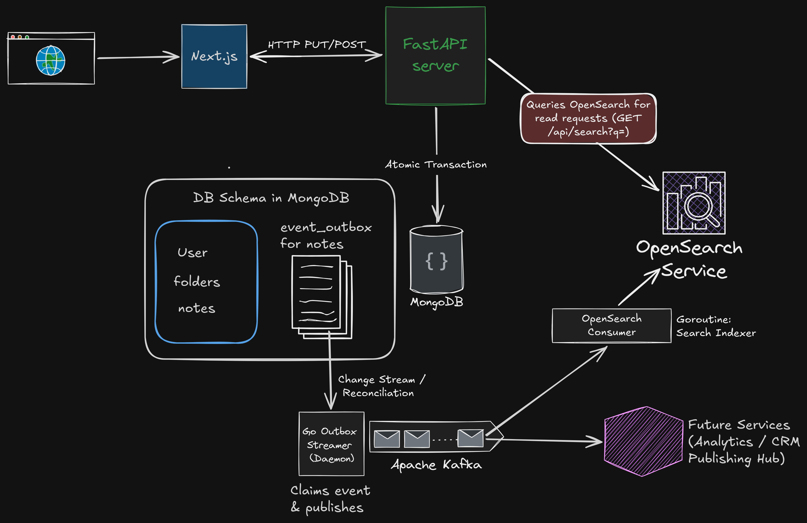

# jam-note

Welcome to **jam-note**, a tactile, ultra-fast, block-based note-taking application designed for developers and creators who find traditional tools (like Notion) too clinical, rigid, or slow.

The user-facing product brand is **"Jam Notes"** — shown in metadata titles, the in-app header, the landing page, and auth screens — while `jam-note` remains the repository and package name.

With a custom slash-command block editor, an infinite spatial canvas, recursive workspace hierarchies, and a durable event pipeline, jam-note bridges the gap between high-end physical journals, audio synthesizers, and modern documentation wikis.

---

## High-Level Architecture



*(Editable source: [`assets/Jam_note_architecture.excalidraw`](assets/Jam_note_architecture.excalidraw))*

The system is a polyglot monorepo with four deployables:

| Deployable | Path | Role |
|---|---|---|
| **Next.js frontend** | `apps/next-frontend` | App Router UI — landing page, auth, the "Desk" workspace shell, block editor, spatial canvas, profile console, public publishing pages. Proxies `/api/*` to the backend. |
| **FastAPI backend** | `apps/fastapi-backend` | The API surface — auth (JWT in HTTP-only cookies), notes & folders CRUD, trash/restore, export/import, search, and the transactional outbox writer. |
| **Outbox streamer** | `apps/hybrid_outbox_streamer` | Go daemon: tails the `event_outbox` collection via MongoDB Change Streams (plus a reconcile poller) and publishes clean event envelopes to the `jam-note.note-events.v1` Kafka topic. |
| **Search indexer** | `apps/search-indexer` | Go daemon: consumes Kafka events and maintains the block-level full-text index in OpenSearch (deterministic `note_id:block_id` doc IDs, idempotent writes). |

Backing stores: **MongoDB** (authoritative data — users, notes, folders, outbox), **Kafka** (Aiven; durable async domain events), and **OpenSearch** (full-text "magic search" index). Notes remain authoritative in MongoDB — a Kafka outage never loses an accepted note update.

---

## Core Features

- **Block editor** — keyboard-driven, slash-command (`/`) blocks: headings, text, todos, lists, code (with a lightweight highlighter), images, drawings, dividers. Markdown auto-triggers (`# `, `- `, `[ ] `, ` ``` `) and markdown paste parsing. Debounced autosave (5s idle + 30s max-wait cap) with `pagehide`/`visibilitychange` safety flushes and a localStorage draft mirror that survives crashes.
- **Spatial Jam Canvas** — toggle any note between Document and Canvas view: draggable/resizable cards, directional connections, color accents, 16px snap grid, zoom/pan, fit-all framing, hand/pointer tools, and a 50-entry undo/redo history.
- **Workspace tree** — folders (pure containers) and notes (leaves) with drag-and-drop moves, color coding, cycle-rejecting moves, and deletes that lift contents to the parent (never orphan, never cascade).
- **Trash & resilience** — soft delete with 30-day TTL retention, restore/purge, empty notes shredded outright; offline indicator with queued-changes flush on reconnect; a service worker caches pages for offline reloads.
- **Export / Import** — per-note `.md`/`.json`, folder `.zip`/`.json` manifests, full-workspace backups; validated, transactional, idempotent (token-based) JSON import.
- **Magic Search** — ⌘K palette backed by OpenSearch block-level full-text search with highlighted snippets and deep links (`#block-{id}`); graceful fallback to MongoDB title search when OpenSearch is down.
- **Profile console** — display name, password rotation (with current-password check), trash view, import/export pickers.
- **Publishing Hub (CRM)** *(in progress)* — one-click public publishing of notes at `/pub/{username}/{slug}` with view counters and slug management.

---

## Tech Stack

* **Frontend:** Next.js 16.3 (App Router, Turbopack), React 19, TypeScript, Tailwind CSS v4, pnpm 12
* **Backend:** FastAPI, Python 3.14, Pydantic v2, `uv` package manager
* **Workers:** Go 1.23+ (franz-go Kafka client, mongo-driver v2, opensearch-go)
* **Data:** MongoDB (async `motor` driver), Kafka (Aiven), OpenSearch
* **Auth:** JWT in HTTP-only cookies, bcrypt password hashing, strict per-user data isolation (every query filters by `user_id`)

---

## Design Philosophy (Neo-Industrial / Audio-Rack / Tactile Terminal)

A custom visual identity — no templated cream-and-terracotta or generic dark mode:

* **In-app surfaces:** Matte off-black grounds (`#0D0E11`, `#14161C`) with dark graphite steel panels (`#1D2027`), razor-thin `1px solid #2A2F3D` borders, tight corner radii, hard offset shadows — no heavy blurs or pill shapes.
* **Print-stocked furniture:** Paper cards (`#FAF7EF` / `#f3efe6`) with ink borders and gold hard shadows carry the "filed document" DNA.
* **Accents:** Electric neon (`#D1FF4D`), cyber-amber/gold (`#FFB800`), and Riso Red (`#ff3d1c`) used with sharp restraint.
* **Typography:** Archivo (display), Newsreader (serif body), Space Mono (status/HUD); pointer-proximity variable-font kinetics on landing and auth titles.

---

## Project Structure & Blueprints

```
jam-note/
├── apps/
│   ├── fastapi-backend/       # FastAPI API server (uv, Pydantic v2, motor)
│   ├── next-frontend/         # Next.js App Router frontend (pnpm)
│   ├── hybrid_outbox_streamer/  # Go: outbox → Kafka publisher daemon
│   └── search-indexer/        # Go: Kafka → OpenSearch indexer daemon
├── assets/                    # Architecture diagrams (PNG + Excalidraw source)
├── DOCS/                      # Blueprints & rules (below)
├── INSTALLATION.md            # Setup, local dev, and Docker instructions
├── api_start.sh               # Backend dev launcher
└── web_start.sh               # Frontend dev launcher
```

All blueprints, requirements, and structural rules live in `/DOCS`:

1. 📑 **[PRD (Product Requirements)](DOCS/PRD.md)** — user flows, core features (block editor, spatial canvas, CRM/publishing hub), non-functional requirements.
2. 📐 **[ARCHITECTURE](DOCS/ARCHITECTURE.md)** — MongoDB schemas, modular FastAPI routes, App Router patterns, eventing/outbox/worker model.
3. 🏁 **[IMPLEMENTATION PHASES](DOCS/PHASES.md)** — the phased execution plan and verification checklists.
4. 📏 **[CODEBASE RULES](DOCS/RULES.md)** — code standards, Pydantic practices, and visual layout guides.

---

## Getting Started

Installation, local development, and running the Docker image (`gaurav0s/jam-note-fastapi:latest`) are documented in **[INSTALLATION.md](INSTALLATION.md)**.

Quick reference for daily work:

```bash
./api_start.sh   # FastAPI backend  → http://localhost:8000
./web_start.sh   # Next.js frontend → http://localhost:3000
```
